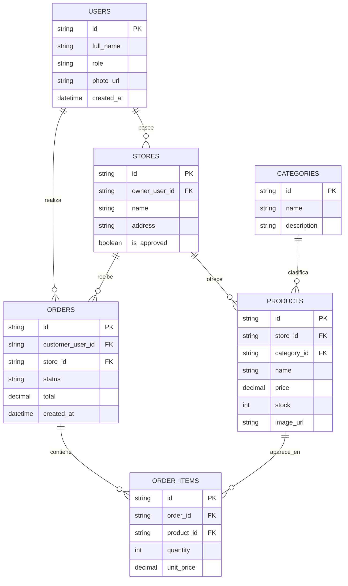

# Diagrama Entidad-Relación

```mermaid
erDiagram
    USERS ||--o{ STORES : "posee"
    USERS ||--o{ ORDERS : "realiza"
    STORES ||--o{ PRODUCTS : "ofrece"
    STORES ||--o{ ORDERS : "recibe"
    CATEGORIES ||--o{ PRODUCTS : "clasifica"
    ORDERS ||--o{ ORDER_ITEMS : "contiene"
    PRODUCTS ||--o{ ORDER_ITEMS : "aparece_en"

    USERS {
        string id PK
        string full_name
        string role
        string photo_url
        datetime created_at
    }
    STORES {
        string id PK
        string owner_user_id FK
        string name
        string address
        boolean is_approved
    }
    CATEGORIES {
        string id PK
        string name
        string description
    }
    PRODUCTS {
        string id PK
        string store_id FK
        string category_id FK
        string name
        decimal price
        int stock
        string image_url
    }
    ORDERS {
        string id PK
        string customer_user_id FK
        string store_id FK
        string status
        decimal total
        datetime created_at
    }
    ORDER_ITEMS {
        string id PK
        string order_id FK
        string product_id FK
        int quantity
        decimal unit_price
    }
```